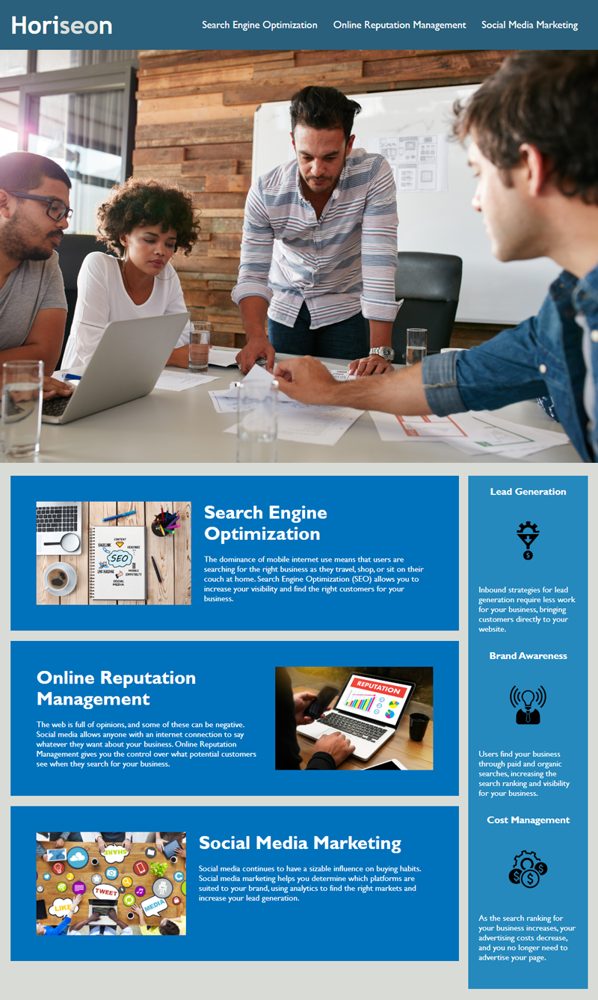

# Module 1 Challenge: CSS Refactoring

Website description: Horiseon's main website is a platform dedicated to showcasing the company's expertise in Search Engine Optimization (SEO), Online Reputation Management, and Social Media Marketing.

**User Story**:
```
AS A marketing agency
I WANT a codebase that follows accessibility standards
SO THAT our own site is optimized for search engines
```

**Acceptance Criteria**: 
```
GIVEN a webpage meets accessibility standards
WHEN I view the source code
THEN I find semantic HTML elements
WHEN I view the structure of the HTML elements
THEN I find that the elements follow a logical structure independent of styling and positioning
WHEN I view the icon and image elements
THEN I find accessible alt attributes
WHEN I view the heading attributes
THEN they fall in sequential order
WHEN I view the title element
THEN I find a concise, descriptive title
```
## Webpage screenshot ##


## Source code ##
Source code was provided by course and the css stylesheet has been refactored for simplicity in code as well as semantic structure with helpful notes. The HTML file was also refactored to include semantic structure. 

## Overview
The website is structured with a clear navigation bar at the top, followed by a hero section. The main content area provides detailed information on the three core services offered by Horiseon. Additionally, there's a benefits section highlighting the advantages of their services, and a footer with company information.

## Webapge layout
  Navigation Bar: Contains the company logo and links to different sections of the website.
  Hero Section: A visually appealing section meant to capture the attention of visitors.
  Benefits Section: Highlights the benefits of using Horiseon's services, including lead generation, brand awareness, and cost management.
  Footer: Contains a heartfelt message from the Horiseon team and copyright information.

## Types of services provided on webpage:
  Search Engine Optimization: Details on how SEO can help businesses increase visibility and attract the right customers.
  
  Online Reputation Management: Information on managing and controlling the online reputation of a business.
  
  Social Media Marketing: Insights into leveraging social media for brand growth and lead generation.

## Assets
The website utilizes various images to enhance the user experience and provide visual context for the services and benefits described. These images are stored in the ./assets/images/ directory.

## Styles
The website's look and feel are defined in the style.css file located in the ./assets/css/ directory.

